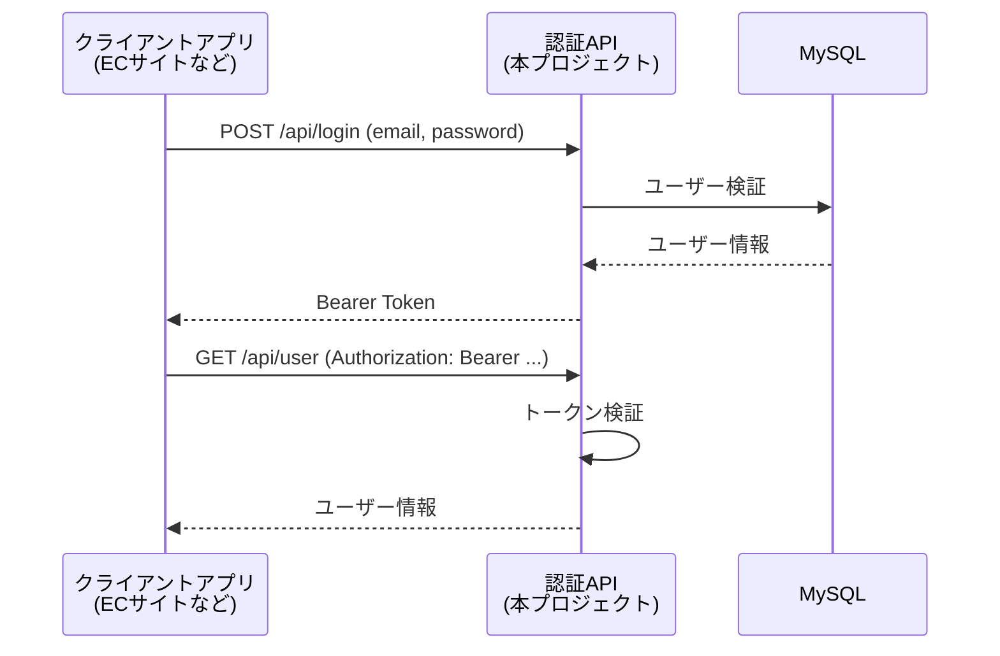

# Authentication General API (汎用認証API)

複数のポートフォリオアプリで共有利用することを想定した、スタンドアロンの認証APIサービス。
Laravel Sanctum によるトークンベース認証を提供する。

> ※ **Status:** Development (開発中)

---

## 〇 概要

各ポートフォリオアプリ(ECサイト、ゲームアプリなど)に認証ロジックを個別実装すると、
ユーザー管理が分散し、セキュリティ実装の重複も発生する。

本プロジェクトは、認証機能を**独立したAPIサービス**として切り出し、
複数のクライアントアプリから共通利用できる基盤を提供することを目的とする。

---

## 〇 主な機能

- [x] ユーザー登録 / ログイン / ログアウト
- [x] Sanctumによるトークン発行・管理
- [ ] トークンの失効・リフレッシュ
- [ ] 管理画面 (Filamentによる実装を検討中)
- [ ] パスワードリセット
- [ ] メール認証
- [ ] レート制限

---

## 〇 技術スタック

| カテゴリ | 技術 |
|---------|------|
| フレームワーク | Laravel 13 |
| 認証 | Laravel Sanctum (トークンベース) |
| データベース | MySQL |
| 管理画面 | Filament (予定) |
| PHP | 8.x |

---

## 〇 アーキテクチャ



### 設計判断

**なぜ Passport (OAuth 2.0) ではなく Sanctum を選んだか**

当初は OAuth 2.0 / OIDC を Laravel Passport で実装する方向で検討していたが、
以下の理由から Sanctum に変更した:

- ポートフォリオ用途では OAuth 2.0 のフルスペック(認可コードフロー、リフレッシュトークン等)はオーバースペック
- Sanctum の方がトークンベース認証をシンプルに実装でき、API利用に十分
- 第三者アプリへの認可委譲は当面想定していない (自分のアプリ間でのみ使用)
- 将来的に OAuth が必要になれば Passport への移行も可能

**管理画面の認証分離**

API利用者の認証(Sanctum) と 管理画面のログイン認証 は別系統で実装する方針。
管理画面はセッションベースの通常のWeb認証とし、API認証ロジックと混在させない。

---

## 〇 セットアップ

### 必要環境

- PHP 8.x
- Composer
- MySQL

### インストール手順

```bash
# リポジトリをクローン
git clone https://github.com/N-Flat/authentication-general.git
cd authentication-general

# 依存パッケージのインストール
composer install

# 環境変数の設定
cp .env.example .env
php artisan key:generate

# .env を編集して DB 接続情報を設定
# DB_DATABASE=authentication_general
# DB_USERNAME=root
# DB_PASSWORD=

# マイグレーション実行
php artisan migrate

# 開発サーバー起動
php artisan serve
```

---

## 〇 API エンドポイント

### 認証関連

| Method | Endpoint | 説明 | 認証 |
|--------|----------|------|------|
| POST | `/api/register` | ユーザー登録 | 不要 |
| POST | `/api/login` | ログイン (トークン発行) | 不要 |
| POST | `/api/logout` | ログアウト (トークン失効) | 必要 |
| GET | `/api/user` | 認証済みユーザー情報取得 | 必要 |

### リクエスト例

**ログイン**

```bash
curl -X POST http://localhost:8000/api/login \
  -H "Content-Type: application/json" \
  -H "Accept: application/json" \
  -d '{
    "email": "user@example.com",
    "password": "password"
  }'
```

**レスポンス例**

```json
{
  "token": "1|xxxxxxxxxxxxxxxxxxxxxxxxxxxxxxxx",
  "user": {
    "id": 1,
    "name": "N_flat",
    "email": "user@example.com"
  }
}
```

**認証が必要なリクエスト**

```bash
curl -X GET http://localhost:8000/api/user \
  -H "Authorization: Bearer 1|xxxxxxxxxxxxxxxxxxxxxxxxxxxxxxxx" \
  -H "Accept: application/json"
```

---

## 〇 ディレクトリ構成 (主要部分)

```
authentication-general/
├── app/
│   ├── Http/
│   │   ├── Controllers/Api/    # API用コントローラ
│   │   └── Requests/            # フォームリクエスト
│   └── Models/
├── routes/
│   └── api.php                  # APIルート定義
├── database/
│   └── migrations/
└── tests/                       # PHPUnit テスト
```

---

## 〇 今後の予定

- [ ] Filamentによる管理画面の実装
- [ ] トークンの有効期限設定
- [ ] パスワードリセット機能
- [ ] メール認証フロー
- [ ] レート制限の実装
- [ ] OpenAPI (Swagger) によるAPI仕様書自動生成
- [ ] サンプルクライアントアプリとの連携実装
- [ ] デプロイ (本番環境への公開)

---

## 〇 Author

**N_flat**

- Portfolio: [n-flat.com](https://n-flat.com)
- GitHub: [@N-Flat](https://github.com/N-Flat)

---

## 〇 License

This project is for portfolio purposes.